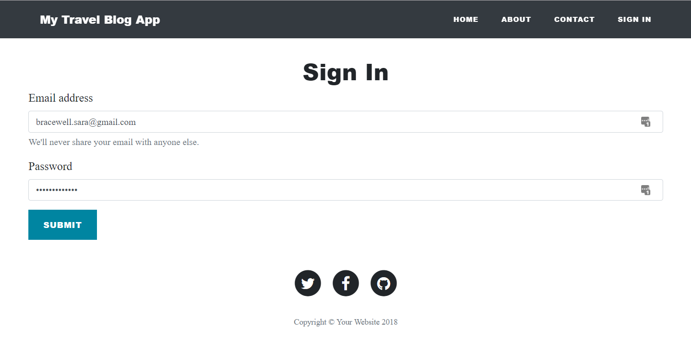

# My Travel Blog

### Overview


This is a simple blog application that allows general users to view a summary of my travel blogs on the home page and click on a blog summary to access the full blog. 

#### An Administrator can Sign In:


#### Add a New Blog:


#### Edit or Delete a Blog:

or create a new administrator. The login is done with Passport, Passport-Local and Express-Session.

The blog and user information is saved in MongoDB. The images are url addresses from UnSplash.com.

I have used ejs, which is a simple templating language that lets you generate HTML markup with plain JavaScript. This makes the code dryer (less repetative code) as you can have a header and footer file as welll as repeat code for each blog entry. I found it easier to use than handlebars.js.

The add a blog page uses an editor, ckeditor, to help make adding a blog with correct styling easy for the administrator. This means they do not have to know HTML coding to stylize the blog.

	
## Getting Started

This app is deployed at [https://2crazyflowers.github.io/MyBlog/](https://2crazyflowers.github.io/MyBlog/). Or you can get the app set up on your own local computer.

These instructions will get you a copy of the project up and running on your local machine for development and testing purposes. See deployment for notes on how to deploy the project on a live system.

### NPM Packages or other programs needed
This app require the following software to be installed on your computer:
* [MongoDB]()
* [Node.js](https://nodejs.org/en/)

Other technology used for this app:
*[CKEDITOR](https://ckeditor.com/ckeditor-4/)

This app requires the following npm packages to be installed:
* [Express](https://www.npmjs.com/package/express)
* [Mongoose](https://www.npmjs.com/package/mongoose)
* [Body-Parser](https://www.npmjs.com/package/body-parser)
* [EJS](https://www.npmjs.com/package/express)

These npm packages are specifically for login authentication:
* [Passport](https://www.npmjs.com/package/passport)
* [Passport-Local](https://www.npmjs.com/package/passport-local)
* [Express-Session](https://www.npmjs.com/package/express-session)

I would also install nodemon so that anytime you make changes to your app you don't need to restart the app (server) file.
*[Nodemon](https://www.npmjs.com/package/nodemon)

## File Structure

```
MyBlog
├── models
|  ├── blogModel.js
|  └── userModel.js
├── public
|  ├── css
|  |    └── main.css
|  ├── images
|  |    └── 
|  └── js
|       ├── clean-blog.js
|       ├── contact_me.js
|       ├── jqBootstrapValidation.js
|       └── jqBootstrapValidation.min.js
├── routes
|  ├── adminRoutes.js
|  ├── blogRoutes.js
|  └── siteRoutes.js
├── views
|   ├── partials
|   |    ├── header.ejs
|   |    └── footer.ejs
|   ├── about.ejs
|   ├── addNewBlog.ejs
|   ├── blog.ejs
|   ├── contact.ejs
|   ├── home.ejs
|   ├── signIn.ejs
|   ├── signUp
|   └── updateBlog.ejs
├── .gitignore
├── app.js
├── package-lock.json
└──  package.json
```

## Instructions on setting up and running this app on your computer

#### App Setup

1. Fork a copy of this project to your Github repo and clone it to your computer.

1. Go to your Git Bash and got to into the folder called `MyBlog`.

1. To get the packages required to run this app type into the command line `npm install`


### Open in Your Code Editor
1. Open the `MyBlog` folder in your text editor of choice (I suggest either `Visual Studio Code` or `Sublime Text`).

1. Then open your terminal (I use `GitBash`) and go to the main folder of `MyBlog`

1. Type `npm install` and hit enter

1. Start your mongodb server by opening a command prompt window and typing `mongod`

1. To install nodemon globally type `npm install -g nodemon`

1. To start the application type `nodemon app.js`, or `nodemon app`. This is what you should see in your terminal after you hit enter so you know it is working correctly:


1. When you are ready to stop the app, in the command line hit `control C`

1. Type in your browser `http://localhost:3000/` unless you already have something else running on that port in which case it will go to 3001.


#### Features


## Deployment

This application is delployed at [SarasTravelBlog](https://sarastravelblog.herokuapp.com/)


## Author

[Sara Bracewell](https://github.com/2crazyflowers)


## Issues or Future wants for the App

I would like to figure out how to store images in MongoDB so that you can use your own images, and not just ones from the internet.

Contact me form is still being worked on.

## Helpful Links
* [MongoDB Documentation](https://docs.mongodb.com/manual/)
* [Mongoose Documentation](http://mongoosejs.com/docs/api.html)

---
